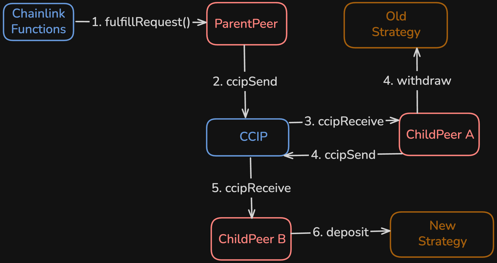

# YieldCoin aka Contract Level Yield (CLY)

This project is being built for the Chainlink Chromion Hackathon, and is an automated, crosschain, stablecoin yield optimizer, powered by Chainlink Automation, Functions, and CCIP.

Whatever the highest yield is for stablecoins across chains is what users can earn in one click with Contract Level Yield.

A live demo site with Ethereum, Base and Avalanche testnets is available at [contractlevel.com](https://contractlevel.com).

“one click highest yield”

## Table of Contents

- [YieldCoin aka Contract Level Yield (CLY)](#yieldcoin-aka-contract-level-yield-cly)
  - [Table of Contents](#table-of-contents)
  - [Overview](#overview)
  - [YieldCoin](#yieldcoin)
  - [Strategy](#strategy)
  - [Contracts/Architecture](#contractsarchitecture)
    - [YieldPeer](#yieldpeer)
      - [IYieldPeer Interface](#iyieldpeer-interface)
      - [Libraries](#libraries)
    - [ParentPeer](#parentpeer)
    - [ChildPeer](#childpeer)
  - [System Actors](#system-actors)
  - [Chainlink Integrations](#chainlink-integrations)
    - [Chainlink Automation](#chainlink-automation)
      - [Time-Based](#time-based)
      - [Log-Trigger](#log-trigger)
    - [Chainlink Functions](#chainlink-functions)
      - [Javascript](#javascript)
      - [Proxy API](#proxy-api)
    - [CCIP](#ccip)
      - [Custom CCIP Transaction Types](#custom-ccip-transaction-types)
  - [Transaction Flows](#transaction-flows)
    - [Rebalance](#rebalance)
      - [Rebalance when Old Strategy is Parent and New Strategy is Parent](#rebalance-when-old-strategy-is-parent-and-new-strategy-is-parent)
      - [Rebalance when Old Strategy is Parent and New Strategy is Child](#rebalance-when-old-strategy-is-parent-and-new-strategy-is-child)
      - [Rebalance when Old Strategy is Child and New Strategy is Parent](#rebalance-when-old-strategy-is-child-and-new-strategy-is-parent)
      - [Rebalance when Old Strategy is Child and New Strategy is Local Child](#rebalance-when-old-strategy-is-child-and-new-strategy-is-local-child)
      - [Rebalance when Old Strategy is Child and New Strategy is Remote Child](#rebalance-when-old-strategy-is-child-and-new-strategy-is-remote-child)
    - [Deposit](#deposit)
      - [Deposit on Parent when Parent is Strategy](#deposit-on-parent-when-parent-is-strategy)
      - [Deposit on Parent when Child is Strategy](#deposit-on-parent-when-child-is-strategy)
      - [Deposit on Child when Parent is Strategy](#deposit-on-child-when-parent-is-strategy)
      - [Deposit on Child when Local Child is Strategy](#deposit-on-child-when-local-child-is-strategy)
      - [Deposit on Child when Remote Child is Strategy](#deposit-on-child-when-remote-child-is-strategy)
    - [Withdraw](#withdraw)
      - [Withdraw on Parent when Parent is Strategy](#withdraw-on-parent-when-parent-is-strategy)
      - [Withdraw on Parent when Child is Strategy](#withdraw-on-parent-when-child-is-strategy)
      - [Withdraw on Child when Parent is Strategy](#withdraw-on-child-when-parent-is-strategy)
      - [Withdraw on Child when Local Child is Strategy](#withdraw-on-child-when-local-child-is-strategy)
      - [Withdraw on Child when Remote Child is Strategy](#withdraw-on-child-when-remote-child-is-strategy)
  - [Deploying](#deploying)
    - [LINK Token Funding](#link-token-funding)
  - [Testing](#testing)
    - [Unit Tests](#unit-tests)
    - [Invariant Tests](#invariant-tests)
    - [Other Tests](#other-tests)
  - [Formal Verification](#formal-verification)
  - [Known Issues](#known-issues)
  - [Testnet Deployments](#testnet-deployments)
    - [Eth Sepolia](#eth-sepolia)
    - [Base Sepolia](#base-sepolia)
    - [Avalanche Fuji](#avalanche-fuji)
  - [Testnet Transactions](#testnet-transactions)
    - [Rebalance](#rebalance-1)
    - [Deposit tx from chain c (avalanche) → parent (eth) → strategy (base)](#deposit-tx-from-chain-c-avalanche--parent-eth--strategy-base)
    - [Withdraw tx from chain c (avalanche) → parent (eth) → strategy (base)](#withdraw-tx-from-chain-c-avalanche--parent-eth--strategy-base)
    - [YieldCoin Bridge tx (eth -\> aval)](#yieldcoin-bridge-tx-eth---aval)
  - [Future Developments](#future-developments)
  - [Acknowledgement](#acknowledgement)

## Overview

**Problem statement**: "I want my stablecoins to earn the highest possible yield without having to monitor opportunities, then manually withdraw, bridge and deposit."

**Solution**: YieldCoin abstracts ALL of that away. Deposit your stablecoin into the CLY system from your chain of choice to earn the highest yield from the safest, most reliable services across the web3 ecosystem.

Stablecoin depositors receive a share token in return for their deposits, representing their share of the total value (deposits + yield) in the system. Depositing a stablecoin can also be considered "buying" YieldCoin. YieldCoin is the share received for depositing into the system, with the basic idea being that a holder will be able to "sell" (their YieldCoin) for a higher USD value than they bought it. This is because the stablecoin deposits will not go down in value, and reliable yield will be generated. Hence the name YieldCoin.

key invariant: a user must be able to withdraw the usdc amount they deposited - fees. this is definitely broken by the precision loss bug we already know

The protocol and chain with the highest APY, where the system funds are allocated is known as the `Strategy`.

## YieldCoin

YieldCoin follows the [ERC677](https://github.com/ethereum/EIPs/issues/677) and [CCT](https://docs.chain.link/ccip/concepts/cross-chain-token) standards for maximum efficiency and interoperability. The YieldCoin CCIP pools are permissionless, allowing holders to move freely across chains. `ERC677.transferAndCall()` enables holders to withdraw USDC in a single tx, without having to approve the CLY infrastructure to transfer their YIELD first. See [./src/token/Share.sol](https://github.com/contractlevel/yield/blob/main/src/token/Share.sol).

The more fees CLY generates, ie the more YieldCoin is bought, the more frequent the checks for the highest APY can become, as Chainlink fees are covered.

## Strategy

The "[Strategy](https://github.com/contractlevel/yield/blob/726c449fb57a0cdb6d77ad9234014f49032a8d33/src/interfaces/IYieldPeer.sol#L5-L8)" refers to the chain and protocol the total system funds are allocated to generate the optimal yield. Low-risk, time-tested, and secure protocols have been selected for this initial prototype. For now the system supports Aave and Compound. As development progresses, the plan is to integrate as many strategy protocols as possible, without risking user funds. The system should always be able to withdraw all user deposits + yield generated. Therefore supplying USDC to earn APY from protocols like Aave and Compound is seen as a safe, low-risk yield strategy.

"Strategy rebalancing" or simply "rebalancing" refers to the automated process of withdrawing funds from the previous strategy and depositing them into the new strategy, to earn a higher yield.

## Contracts/Architecture

The Contract Level Yield system that powers YieldCoin consists of a crosschain network of "Peer" contracts. `YieldPeer` contracts are deployed on each compatible chain, and act as entry points to the system. Currently the only supported stablecoin is `USDC` (due partially to its availability across chains with CCIP and the time constraints of the hackathon).

Users deposit their `USDC` into the CLY infrastructure from their chain of choice. In return they receive YieldCoin ($YIELD) tokens. The amount of YieldCoin a depositor is minted in exchange for their stablecoin deposit is proportional to how much of the system's total value (total deposits + generated yield) their stablecoin deposit is worth. The basic idea is that a user will always be able to redeem their YieldCoin for the stablecoin they deposited plus yield (minus fees, but fees haven't been implemented yet).

There are two types of `YieldPeer` contracts: a `ParentPeer` and a `ChildPeer`. There is a single `ParentPeer` contract deployed across chains, with every other compatible chain hosting a `ChildPeer`. See [./src/peers](https://github.com/contractlevel/yield/tree/main/src/peers).

### YieldPeer

[`YieldPeer`](https://github.com/contractlevel/yield/blob/main/src/peers/YieldPeer.sol) is an abstract contract that acts as the "base" for both the `ParentPeer` and `ChildPeer` contracts. The Parent and Child peers share some functionality, but also have functionality unique to their particular roles in the system. The shared `YieldPeer` functionality consists primarily of CCIP integrations and yield strategy interactions.

Contracts that inherit `YieldPeer` must implement the following functions:

- `deposit(uint256)` - user entry point for the system where USDC is deposited and YieldCoin is minted
- `onTokenTransfer(address,uint256,bytes)` - user exit point for the system where YieldCoin is burned and USDC is withdrawn
- `_handleCCIPMessage(CcipTxType,Client.EVMTokenAmount[],bytes)` - executed following `_ccipReceive` checks to handle various CCIP tx types

The Peer with the current active strategy will return a non-zero address from `YieldPeer::getStrategyPool()`.

#### IYieldPeer Interface

The [IYieldPeer interface](https://github.com/contractlevel/yield/blob/main/src/interfaces/IYieldPeer.sol) defines important structs and enums for the system, related to Strategy protocol and CCIP message handling, such as compatible strategies, custom types of CCIP txs, and what data is sent across chains for deposits and withdraws.

#### Libraries

Some logic from `YieldPeer` has been delegated to distinct libraries to improve maintainability.

[CCIPOperations](https://github.com/contractlevel/yield/blob/main/src/libraries/CCIPOperations.sol) contains logic for facilitating CCIP fees, creating CCIP messages, and handling bridged USDC token amounts.

[ProtocolOperations](https://github.com/contractlevel/yield/blob/main/src/libraries/ProtocolOperations.sol) contains logic for interacting with strategy protocols such as depositing, withdrawing, and querying the total value of the system.

[DataStructures](https://github.com/contractlevel/yield/blob/main/src/libraries/DataStructures.sol) contains logic for creating [DepositData](https://github.com/contractlevel/yield/blob/726c449fb57a0cdb6d77ad9234014f49032a8d33/src/interfaces/IYieldPeer.sol#L28-L34) and [WithdrawData](https://github.com/contractlevel/yield/blob/726c449fb57a0cdb6d77ad9234014f49032a8d33/src/interfaces/IYieldPeer.sol#L36-L42) structs, which are used in CCIP messages for deposits and withdraw respectively.

### ParentPeer

The [`ParentPeer`](https://github.com/contractlevel/yield/blob/main/src/peers/ParentPeer.sol) contract tracks system wide state for Contract Level Yield, specifically the total shares (YieldCoin) minted, and the current yield strategy. `ParentPeer::s_totalShares` is the sum of all shares/YieldCoin that exists across chains. `ParentPeer::s_strategy` is a struct containing the chain selector and protocol of the current yield generating strategy.

The `ParentPeer` contract is extended with the [`ParentCLF`](https://github.com/contractlevel/yield/blob/main/src/peers/extensions/ParentCLF.sol) contract. `ParentCLF` inherits `ParentPeer` and implements Chainlink Functions functionality. As such, `ParentCLF` is the single `ParentPeer` instantiation deployed in the system. `ParentCLF` also implements functionality to make it compatible with Chainlink Automation.

[`ParentRebalancer`](https://github.com/contractlevel/yield/blob/main/src/modules/ParentRebalancer.sol) is deployed on the same chain as `ParentCLF`. The `ParentRebalancer` contract provides supplementary log trigger automation functionality to `ParentCLF`, as the `ParentCLF` contract is unfortunately too big to contain it all itself.

### ChildPeer

The [`ChildPeer`](https://github.com/contractlevel/yield/blob/main/src/peers/ChildPeer.sol) is deployed on every chain except for the chain hosting the `ParentPeer`. Similar to `ParentPeer`, `ChildPeer` facilitates deposits, withdraws, and handling CCIP rebalance messages.

## System Actors

The only two actors in this system are stablecoin depositors and the owner of the contracts.

**Stablecoin depositors** deposit USDC and receive YieldCoin. They can then move their YieldCoin around chains or `transferAndCall()` it to a `YieldPeer` to redeem their USDC + yield.

The **Owner** sets various values required for the system to function, such as CCIP gas limit, Automation Forwarder and Upkeep addresses, and allowed chains and peers.

## Chainlink Integrations

Chainlink services provide essential functionality to the Contract Level Yield system. Automation, Functions and CCIP are combined to automate rebalances, and CCIP is also used where applicable in stablecoin deposits and withdraws.

### Chainlink Automation

Automation removes the need for any human/manual intervention for the system to consistently maintain the highest yield available.

#### Time-Based

The strategy rebalancing process starts with a pre-scheduled call from the Chainlink Automation service, to request the optimal strategy via Chainlink Functions. [`ParentCLF::sendCLFRequest()`](https://github.com/contractlevel/yield/blob/726c449fb57a0cdb6d77ad9234014f49032a8d33/src/peers/extensions/ParentCLF.sol#L110-L111) is called by the Chainlink Automation `upkeep` address and requires no further configuration in the contract, other than access control preventing non-upkeep addresses from calling.

#### Log-Trigger

When a new strategy is set by the Chainlink Functions [`fulfillRequest()` callback](https://github.com/contractlevel/yield/blob/726c449fb57a0cdb6d77ad9234014f49032a8d33/src/peers/extensions/ParentCLF.sol#L128-L157), a [`StrategyUpdated`](https://github.com/contractlevel/yield/blob/726c449fb57a0cdb6d77ad9234014f49032a8d33/src/peers/ParentPeer.sol#L350) event is emitted. The `ParentRebalancer` will [check for this event](https://github.com/contractlevel/yield/blob/726c449fb57a0cdb6d77ad9234014f49032a8d33/src/modules/ParentRebalancer.sol#L44-L91) and initiate CCIP rebalance txs when applicable.

### Chainlink Functions

Chainlink Functions is used to securely fetch and return the protocol and chain with the highest APY available, to update the current strategy.

#### Javascript

The inline Javascript `SOURCE` code passed to Chainlink Functions is defined as [a constant in `ParentCLF`](https://github.com/contractlevel/yield/blob/726c449fb57a0cdb6d77ad9234014f49032a8d33/src/peers/extensions/ParentCLF.sol#L30-L32) and runs a remote script from the [project repo](https://github.com/contractlevel/yield/blob/main/functions/src.min.js).

[src.js](https://github.com/contractlevel/yield/blob/main/functions/src.js) demonstrates the logic of the remote script performed by the Chainlink Functions DON. To increase efficiency, the actual script that is run, is a [minimized equivalent](https://github.com/contractlevel/yield/blob/main/functions/src.min.js). The script queries and handles API data from the [DefiLlama Yield API](https://yields.llama.fi/pools).

Javascript logic related to Functions can be found in the [./functions directory](https://github.com/contractlevel/yield/tree/main/functions).

#### Proxy API

A proxy API was required for communicating between Chainlink Functions and the DefiLlama API, because the DefiLlama API payload response was too large for Chainlink Functions, so we filter on the server side via our proxy API.

To prepare the proxy API, navigate to its directory and install the dependencies:

```
cd functions/defillama-proxy
npm i
```

The `function.zip` file located in `functions/defillama-proxy` has been uploaded to AWS Lambda and deployed.

To prevent abuse, the url of the proxy API has been encrypted as an [offchain secret](https://www.npmjs.com/package/@chainlink/functions-toolkit#off-chain-hosted-secrets) and stored as [a constant in `ParentCLF`](https://github.com/contractlevel/yield/blob/726c449fb57a0cdb6d77ad9234014f49032a8d33/src/peers/extensions/ParentCLF.sol#L33-L37).

### CCIP

CCIP faciliates secure crosschain communication and value transfer for rebalances, and, where applicable, deposits and withdraws. [Custom CCIP tx types have been defined](https://github.com/contractlevel/yield/blob/726c449fb57a0cdb6d77ad9234014f49032a8d33/src/interfaces/IYieldPeer.sol#L15-L26) and are used to ensure receiving contracts correctly handle data and/or value.

#### Custom CCIP Transaction Types

- **0 - DepositToParent**: A deposit transaction from a `ChildPeer` to the `ParentPeer`. This is necessary to forward deposits to remote strategy chains.
- **1 - DepositToStrategy**: A deposit transaction from the `ParentPeer` to the active Strategy. This deposits funds in the strategy protocol and gets the `totalValue` of the system.
- **2 - DepositCallbackParent**: A callback transaction from the active Strategy to the `ParentPeer`. This returns the `totalValue`, which is used to calculate the `shareMintAmount` (how many YieldCoin a depositor should receive) and update `s_totalShares`.
- **3 - DepositCallbackChild**: A callback from the `ParentPeer` to the `ChildPeer` the deposit was initiated on. This mints shares/YieldCoin to the depositor.
- **4 - WithdrawToParent**: A withdraw from a `ChildPeer` to the `ParentPeer`. This forwards the withdrawal to the active strategy and updates `s_totalShares` to reflect the amount of YieldCoin burned when initiating the withdrawal.
- **5 - WithdrawToStrategy**: A withdraw from the `ParentPeer` to the active Strategy. This calculates the `usdcWithdrawAmount` and withdraws it from the active Strategy.
- **6 - WithdrawCallback**: A callback from the active Strategy to the withdraw chain. This sends the withdrawn USDC to the withdrawer.
- **7 - RebalanceOldStrategy**: A message from the `ParentPeer` to the old Strategy. This is to move funds to the new Strategy.
- **8 - RebalanceNewStrategy**: A value transfer from the old Strategy to the new Strategy. This is to deposit funds into the new Strategy.

## Transaction Flows

Transaction flows differ based on the nature of the transaction, its point of origin, and the location of the active Strategy.

### Rebalance

This diagram shows a (rough) high-level overview of the entire rebalance process.


The following diagrams show individual rebalance flows for different scenarios.

#### Rebalance when Old Strategy is Parent and New Strategy is Parent


#### Rebalance when Old Strategy is Parent and New Strategy is Child


#### Rebalance when Old Strategy is Child and New Strategy is Parent


#### Rebalance when Old Strategy is Child and New Strategy is Local Child


#### Rebalance when Old Strategy is Child and New Strategy is Remote Child



### Deposit

#### Deposit on Parent when Parent is Strategy

#### Deposit on Parent when Child is Strategy

#### Deposit on Child when Parent is Strategy

#### Deposit on Child when Local Child is Strategy

#### Deposit on Child when Remote Child is Strategy

### Withdraw

Withdrawals are executed using the YieldCoin/share token's `ERC677::transferAndCall()`, which checks if the receiving address has implemented `IERC677Receiver::onTokenTransfer()`, which the `YieldPeer`, `ParentPeer`, and `ChildPeer` contracts have.

See [Parent Withdraw](https://github.com/contractlevel/yield/blob/b9f9ae814852bf2744fbede6ca4fda29d69ef7e3/src/peers/ParentPeer.sol#L119-L180) and [Child Withdraw](https://github.com/contractlevel/yield/blob/b9f9ae814852bf2744fbede6ca4fda29d69ef7e3/src/peers/ChildPeer.sol#L75-L95).

The chain to receive the withdrawn USDC on can be different to the chain the withdrawal was initiated on, by passing an encoded chain selector as the `data` param in `transferAndCall()`. The tx will revert if the data does not decode to an allowed chain. If the data is left empty, the USDC will be withdrawn to the chain the withdrawal tx was initiated on.

Similar to deposits, the system will handle withdrawals depending on the chain of initiation and location of the current strategy.

#### Withdraw on Parent when Parent is Strategy

#### Withdraw on Parent when Child is Strategy

#### Withdraw on Child when Parent is Strategy

#### Withdraw on Child when Local Child is Strategy

#### Withdraw on Child when Remote Child is Strategy

## Deploying

MENTION DEPLOY SCRIPT, HELPER CONFIG AND SETCROSSCHAIN SCRIPT

### LINK Token Funding

For the Contract Level Yield infrastructure to function, LINK is required for the following:

- Time-based Automation subscription on Parent chain
- Log-trigger Automation subscription on Parent chain
- Chainlink Functions subscription on Parent chain
- Every `YieldPeer` on every chain for CCIP txs

## Testing

This project was built with [Foundry](https://getfoundry.sh/introduction/installation/). To run the tests, Foundry and the project's dependancies need to be installed.

```
foundryup
forge install
```

### Unit Tests

The unit tests fork three mainnets, and as such require `RPC_URL`s in a `.env`.

```
ETH_MAINNET_RPC_URL=<your_rpc_url_here>
OPTIMISM_MAINNET_RPC_URL=<your_rpc_url_here>
BASE_MAINNET_RPC_URL=<your_rpc_url_here>
```

The unit tests use a [fork of chainlink-local](https://github.com/contractlevel/chainlink-local). Since the unit tests are performed on forked mainnets, additional functionality was required from chainlink-local in order to facilitate USDC transfers. USDC transfers on CCIP integrate [Circle's CCTP](https://www.circle.com/cross-chain-transfer-protocol), which comes with additional checks that weren't included in the original chainlink-local. The CCTP architecture requires USDC transfer messages to be "validated by attesters". These messages need to be in a [specific format](https://github.com/circlefin/evm-cctp-contracts/blob/6e7513cdb2bee6bb0cddf331fe972600fc5017c9/src/MessageTransmitter.sol#L228-L247) and the attester's signatures need to be in a [specific order](https://github.com/circlefin/evm-cctp-contracts/blob/6e7513cdb2bee6bb0cddf331fe972600fc5017c9/src/MessageTransmitter.sol#L246-L247).

To achieve this, the changes were made to the [CCIPLocalSimulatorFork](https://github.com/contractlevel/chainlink-local/blob/main/src/ccip/CCIPLocalSimulatorFork.sol). A new function, [switchChainAndRouteMessageWithUSDC](https://github.com/contractlevel/chainlink-local/blob/519e854caaf1291c03bda3928674c922195fd629/src/ccip/CCIPLocalSimulatorFork.sol#L126-L155) was added, which is based on the original `switchChainAndRouteMessage`, except it also listens for CCTP's `MessageSent` event, and takes two arrays of attester addresses, and their private keys - values that can be easily simulated with [Foundry's makeAddrAndKey](https://getfoundry.sh/reference/forge-std/make-addr-and-key/).

The `offchainTokenData` array passed to the offRamp needed to contain the USDCTokenPool's `MessageAndAttestation` struct, which contains the message retrieved from the `MessageSent` event and the `attestation` created with the attester's and their private keys. To achieve this, another function was added, [\_createOffchainTokenData](https://github.com/contractlevel/chainlink-local/blob/519e854caaf1291c03bda3928674c922195fd629/src/ccip/CCIPLocalSimulatorFork.sol#L181-L238).

The unit tests for the Contract Level Yield contracts can be run with:

```
forge test --mt test_yield
```

### Invariant Tests

DISCUSS https://github.com/contractlevel/chainlink-local/commit/f56369e24807796e6bd636970d145bb6394a33f6 CHAINLINK-LOCAL FORK HERE

The invariant test suite also uses the fork of chainlink-local, and can be run with:

```
forge test --mt invariant
```

### Other Tests

For the full Foundry test suite (which includes tests for mock contracts and scripts), run:

```
forge test
```

## Formal Verification

This project uses Certora for formal verification. A `CERTORAKEY` is required to use the Certora Prover. Get one [here](https://docs.certora.com/en/latest/docs/user-guide/install.html#step-3-set-the-personal-access-key-as-an-environment-variable).

```
export CERTORAKEY=<personal_access_key>
```

The `BasePeer` spec verifies mutual behavior of the Parent and Child Peers, so there are separate `conf` files for verifying each of them against it.

```
certoraRun ./certora/conf/child/BaseChild.conf
certoraRun ./certora/conf/parent/BaseParent.conf
```

The `Parent` and `Child` specs verify behaviors particular to their respective peers.

```
certoraRun ./certora/conf/parent/Parent.conf
certoraRun ./certora/conf/child/Child.conf
```

The `Yield` spec verifies internal properties of the abstract `YieldPeer` contract such as depositing to and withdrawing from strategies, as well as CCIP tx handling.

```
certoraRun ./certora/conf/Yield.conf
```

The `ParentCLF` spec verifies logic related to Chainlink Functions and Automation.

```
certoraRun ./certora/conf/parent/ParentCLF.conf --nondet_difficult_funcs
```

The `--nondet_difficult_funcs` flag is required for `ParentCLF` to [automatically summarize functions](https://docs.certora.com/en/latest/docs/prover/cli/options.html#nondet-difficult-funcs) in the `FunctionsRequest` library because otherwise the Certora Prover will timeout. The Certora Prover explores all possible paths and the `FunctionsRequest::encodeCBOR` includes an extremely high path count, making it difficult to verify.

## Known Issues

The invariant testing and formal verification revealed a critical precision loss bug, that can cause insufficient amounts of YieldCoin minted in exchange for USDC. If this project had been developed outside the context of the hackathon, this would've been the top priority. Given the time constraints, other more demonstrative elements of this project were completed first. Once the hackathon submission for this project is done, fixing this issue will be the next step.

## Testnet Deployments

The Contract Level Yield infrastructure has been deployed across three testnets (Ethereum Sepolia, Base Sepolia, and Avalanche Fuji), in order to test the various scenarios using Chainlink - all of which are successful.

Ethereum Sepolia is the Parent chain purely because it has open access to Log-trigger Automation (although access was granted to Log-trigger Automation on Base Sepolia after these deployments - thanks!).

[Mock contracts](https://github.com/contractlevel/yield/tree/main/test/mocks/testnet) were used in place of some strategy contracts either due to their unavailability on testnets or their testnet equivalents not behaving as expected. These mocks do not generate any yield, but otherwise behave as their mainnet counterparts would in terms of depositing and withdrawing funds in the context of the Contract Level Yield system.

The DefiLlama API does not provide testnet data, so mainnet data was used to set the strategy protocol and chain.

### Eth Sepolia

ParentRebalancer: https://sepolia.etherscan.io/address/0x107C9A78c447c99289B84476f53620236114AbAa#code

ParentCLF: https://sepolia.etherscan.io/address/0xBE679979Eaec355d1030d6f117Ce5B4b5388318E#code

YieldCoin/share token: https://sepolia.etherscan.io/address/0x37D13c62D2FDe4A400e2018f2fA0e3da6b15718D#code

SharePool (YieldCoin CCIP pool): https://sepolia.etherscan.io/address/0x9CF6491ace3FDD614FB8209ec98dcF98b1e70e4D#code

### Base Sepolia

Child: https://sepolia.basescan.org/address/0x94563Bfe55D8Df522FE94e7D60D2D949ef21BF1c#code

YieldCoin/share token: https://sepolia.basescan.org/address/0x2DF8c615858B479cBC3Bfef3bBfE34842d7AaA90#code

SharePool (YieldCoin CCIP pool): https://sepolia.basescan.org/address/0xEF13904800eFA60BB1ea5f70645Fc55609F00320#code

### Avalanche Fuji

Child: https://testnet.snowtrace.io/address/0xc19688E191dEB933B99cc78D94c227784c8062F9/contract/43113/code

YieldCoin/share token: https://testnet.snowtrace.io/address/0x2891C37D5104446d10dc29eA06c25C6f0cA233Ec/contract/43113/code

SharePool (YieldCoin CCIP pool): https://testnet.snowtrace.io/address/0x9bf12E915461A48bc61ddca5f295A0E20BBBa5D7/contract/43113/code

## Testnet Transactions

### Rebalance

time based auto triggers CLF https://sepolia.etherscan.io/tx/0xc8159327d9c76b118c2caa10c9db513cc38c2c7a00e3c2f026df12d2b5e6190a

clf request callback https://sepolia.etherscan.io/tx/0x2521aea1c73c8ace2b5630b74c60857788944479e8dcd8a7a8362a74f8970a8b

log trigger auto https://sepolia.etherscan.io/tx/0x1099dbd2cd04403635b820cd17508aa7c56929bc99187b39a543a7b36cd50e4d

ccip rebalance https://ccip.chain.link/#/side-drawer/msg/0xb01894363f416f83171ee994cd043eacf4cc487bc2d8a589229d02c2649ed10b

dst tx: https://sepolia.basescan.org/tx/0x35f97388d654b63d80f4d9b88eab11fb4ee16a909862dd19338c8a758565a70c

### Deposit tx from chain c (avalanche) → parent (eth) → strategy (base)

deposit tx: https://testnet.snowtrace.io/tx/0x68b8118e9e9115e8f8956cc05edc06d8fe281f0955a762c830d98a7f87230a06?chainid=43113

deposit to parent: https://ccip.chain.link/#/side-drawer/msg/0x2a996da193b64a4c4c719921655e5fe57d8292914a48572cfafec02c5349bfc7

dst tx: https://sepolia.etherscan.io/tx/0x6685ae8f7c883ab2f83ea43afe838f51b1b8270eab16ebb26cc1782012766fc4

deposit to parent and deposit to strategy: https://ccip.chain.link/tx/0x6685ae8f7c883ab2f83ea43afe838f51b1b8270eab16ebb26cc1782012766fc4

strategy chain deposit: https://sepolia.basescan.org/tx/0x75e0f2ec96dde84126c8ec36f1bc5467c69bdb0b41e5c211e8ab99c65189baa3

deposit callback parent: https://ccip.chain.link/tx/0x75e0f2ec96dde84126c8ec36f1bc5467c69bdb0b41e5c211e8ab99c65189baa3

parent callback: https://sepolia.etherscan.io/tx/0x905c386823c1bceeb07a51c4d67effff82f8db7e1d16f2349fe2ffd053263f8f

deposit callback child: https://ccip.chain.link/tx/0x905c386823c1bceeb07a51c4d67effff82f8db7e1d16f2349fe2ffd053263f8f

final tx minting yieldcoin/shares based on totalValue from strategy chain and totalShares from parent chain: https://testnet.snowtrace.io/tx/0x4c02081f317a22bc7c2d2768ae8e2e1144e0ad0b36a605fc2158a5b34d903123

### Withdraw tx from chain c (avalanche) → parent (eth) → strategy (base)

withdraw initiate with transferAndCall: https://testnet.snowtrace.io/tx/0x1c635d115f41651df0bb29559629e30e82ec8e51f564d73d2bba0a564d8efb0b?chainid=43113

withdraw to parent: https://ccip.chain.link/#/side-drawer/msg/0xc8ebdd6da9a925a7b7e24001f1fc95b8bb650ebee3cbe1cbb9135ed68240d9e7

parent tx where shares are updated: https://sepolia.etherscan.io/tx/0xd6c19a86d0afbd1367cfff0262be838cbfdcf87356767c3b272b0a447269667f

withdraw to strategy: https://ccip.chain.link/tx/0xd6c19a86d0afbd1367cfff0262be838cbfdcf87356767c3b272b0a447269667f#/side-drawer/msg/0xef446fc7fba9cb80ac96fc5fdc69f00fce8a374991828949cdd673373a8bb31b

withdraw from strategy: https://sepolia.basescan.org/tx/0x67271c1cf24250bb942c4e3bc3179ecda9b5bdaa46bda7671a3b4b9415953f70

withdraw callback: https://ccip.chain.link/tx/0x67271c1cf24250bb942c4e3bc3179ecda9b5bdaa46bda7671a3b4b9415953f70#/side-drawer/msg/0x1e5b3ddf52d453d81d4e1c0ec3c0532c90de025391a7f10b483f3c1083b497a0

withdraw success: https://testnet.snowtrace.io/tx/0xbf9a7952bfda2561dcc92e07fe0ca58fd50bc2e88f2920fc9f22a0e96f394162

### YieldCoin Bridge tx (eth -> aval)

ccip: https://ccip.chain.link/tx/0xd0c3e338c66bad81412c92ad7b76681b977464fa85350201b9830bfaf5250956#/side-drawer/msg/0x7f91c48fe14b5d9c6f472afa45551be29d4ff930e51711c99c8e61a980f0ed58

## Future Developments

- more stablecoin support (swapping to one with highest yield, such as USD1, USDT, etc.)
- more chains
- more yield strategies/protocols (such as Euler)
- fees (and automated Chainlink service payments)
- svm compatability
- ccip calldata compression (should use solady.libZip for compressing/decompressing depositData, withdrawData and strategy struct)
- uniswap integration to allow users to "buy" yieldcoin with any asset, ie they pay with eth and it gets swapped to the usdc amount then deposited

## Acknowledgement

The idea for this project came from the [Concero V2 Whitepaper, Section 7.1](https://concero.io/v2_whitepaper.pdf).
